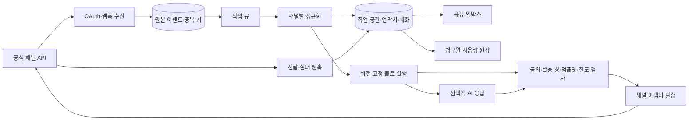

# 메시징 자동화 플랫폼 제품·기술 명세

상태: 초기 설계안.
근거와 확인되지 않은 제약은 [조사 보고서](../notes/2026-09-25-manychat-research.md)에 기록했습니다.
이번 문서는 구현할 제품의 경계를 정하며, 오픈소스 포크나 API 계정 개설을 완료했다는 뜻은 아닙니다.

## 목적과 성공 기준

크리에이터와 소규모 팀이 공식 메시징 API로 댓글·DM·메신저 대화를 자동화하고, 리드를 분류하며, 필요할 때 사람 상담원에게 전환하는 서비스를 구축합니다.
완성 목표는 ManyChat의 새 Pro·Business·Advanced에서 제공하는 주요 사용 사례와 활성 연락처 기반 구독 구조에 대응하는 것입니다.
ManyChat의 공개 기능 기준은 [조사 보고서의 플랜 비교](../notes/2026-09-25-manychat-research.md#manychat-기준선)를 따릅니다.

첫 배포의 성공은 다음 사용자가 한 작업 공간에서 Instagram 계정을 연결하고, 댓글 키워드로 시작한 플로가 공식 API를 통해 허용된 개인 메시지를 보내며, 상담원에게 이어지는 대화를 인박스에서 처리할 수 있는 상태입니다.
그 다음 단계에서 채널·방송·AI·구독 과금을 확장합니다.
전체 기능을 첫 배포에 동시에 넣지 않습니다.

## 대상 사용자와 목표

| 사용자            | 해결할 일                                   | 제품 동작                                                                 |
| ----------------- | ------------------------------------------- | ------------------------------------------------------------------------- |
| 크리에이터·운영자 | 게시물 반응을 리드로 전환합니다.            | 댓글·스토리·DM 트리거를 만들고 링크, 질문, 태그, 후속 단계를 설정합니다.  |
| 상담원            | 자동화가 처리하지 못한 문의를 이어받습니다. | 채널을 가로지르는 인박스에서 담당자, 상태, 내부 메모와 답장을 관리합니다. |
| 작업 공간 관리자  | 팀과 사용량을 통제합니다.                   | 채널 권한, 역할, 발송 한도, 청구월 활성 연락처, 구독 상태를 확인합니다.   |

### 목표

1. 공식 API와 승인된 권한으로 Instagram, Facebook Messenger, WhatsApp, TikTok, Telegram, Email, SMS를 단계적으로 연결합니다.
2. 시각적 플로에서 트리거, 조건, 메시지, 지연, 태그·필드 변경, 웹훅, 상담원 전환을 조합합니다.
3. 채널별 수신 허용, 발송 창, 템플릿, 속도 제한을 발송 시점에 검사합니다.
4. 하나의 작업 공간에서 연락처, 대화, 전달 상태, 자동화 실행, 팀 작업과 구독 사용량을 추적합니다.
5. 활성 연락처를 청구월마다 집계하고 무료 체험, 플랜 권한, 초과 사용 상한, 업·다운그레이드를 지원합니다.
6. AI 응답은 근거와 예산이 확인된 경우에만 자동 발송하고 불확실한 경우 사람에게 넘깁니다.

### 비목표

- ManyChat의 상표, 화면, 문구, 내부 구현 또는 가격을 그대로 복제하지 않습니다.
- 비공식 로그인 자동화, 스크래핑, 사설 API, 계정 비밀번호 보관으로 플랫폼 권한을 우회하지 않습니다.
- 사용자 동의 없이 다른 채널의 식별자를 같은 사람으로 합치거나 마케팅 메시지를 보내지 않습니다.
- 자체 통신망·카드 결제망·범용 CRM·광고 관리자 전체를 만들지 않습니다.
- 첫 배포에서 모든 채널, 모든 국가, 모바일 앱, 고급 A/B 분석과 엔터프라이즈 전용 기능을 동시에 제공하지 않습니다.
- ChatbotX 또는 Chatwoot의 별도 상용 라이선스 파일을 Community Edition에 포함시키지 않습니다.

## 기능 범위와 순서

| 단계     | 포함 기능                                                                                 | 수용 기준                                                                                          |
| -------- | ----------------------------------------------------------------------------------------- | -------------------------------------------------------------------------------------------------- |
| 검증     | 후보 CE 로컬 실행, Instagram 계정 권한, 댓글·DM 웹훅 왕복                                 | 공식 테스트 계정에서 댓글 이벤트 하나가 정확히 한 번의 허용된 개인 응답으로 이어집니다.            |
| 첫 배포  | 작업 공간, Instagram 플로, 키워드·조건·태그, 공유 인박스, 수동 전환, 실행·실패 로그       | 관리자와 상담원이 같은 대화를 중복 발송 없이 이어받고 실패를 재처리할 수 있습니다.                 |
| 유료 MVP | Telegram·WhatsApp, 템플릿과 옵트인, 세그먼트 발송, 활성 연락처 집계, 플랜 권한, 구독 결제 | 청구월 경계·중복 이벤트·결제 실패를 테스트하고 사용량과 청구 금액을 대조할 수 있습니다.            |
| 확장     | TikTok 승인 후 연동, Email·SMS, Google Sheets·CRM 웹훅, AI 응답, 고급 라우팅              | 각 채널의 정책 검사와 비용 한도가 작동하고, 승인되지 않은 기능은 UI와 API 모두에서 비활성화됩니다. |

TikTok과 Instagram의 권한 승인은 제품 코드만으로 보장할 수 없습니다.
승인을 받지 못한 채널은 공개 플랜에서 지원한다고 표시하지 않습니다.
[공식 TikTok Business Messaging 문서](https://business-api.tiktok.com/gateway/docs/index?identify_key=c0138ffadd90a955c1f0670a56fe348d1d40680b3c89461e09f78ed26785164b&language=ENGLISH), [Meta Instagram API 문서](https://www.postman.com/meta/instagram/folder/1z5vxzu/instagram-api-with-instagram-login).

## 기술 스택 결정

ChatbotX Community Edition을 [고정 커밋에서 검증](../notes/2026-09-25-chatbotx-validation.md)했으나 현재는 채택을 보류했습니다.
후보 저장소는 [Next.js·TypeScript 프런트엔드, PostgreSQL·pgvector, Redis·BullMQ 워커, S3 호환 저장소](https://github.com/ChatbotXIO/ChatbotX)를 사용하며, Instagram·WhatsApp·TikTok 어댑터와 자동화 테스트를 포함합니다.
직접 구현에서는 TypeScript와 PostgreSQL을 사용합니다.
현재 코드는 Node.js 24의 타입 제거 실행 기능을 사용해 웹훅 수신 서버와 PostgreSQL 이벤트·outbox 저장, 발송 정책과 워커 모듈을 구현했습니다.
Facebook Login과 Instagram Login용 발송 어댑터와 별도 워커 명령을 구현했습니다.
운영자는 Meta 개발자 대시보드에서 일반 DM 발송에 성공했다고 보고했지만, 이 저장소의 댓글 비공개 답장 발송은 실계정에서 아직 검증하지 않았습니다.
OAuth 계정 연결과 사용자 화면은 아직 구현하지 않았습니다.

| 계층            | 선택                                    | 이유와 도입 조건                                                                                                      |
| --------------- | --------------------------------------- | --------------------------------------------------------------------------------------------------------------------- |
| 웹·관리자 화면  | TypeScript, React, Next.js              | 관리자 화면과 공유 인박스를 구현할 때 도입합니다. 버전은 해당 단계에서 잠금 파일에 고정합니다.                        |
| API·도메인 로직 | TypeScript 서버 모듈                    | 작업 공간, 연락처, 플로, 발송 정책, 과금을 분리하되 하나의 제품 저장소에서 관리합니다.                                |
| 주 데이터       | Supabase PostgreSQL                     | 트랜잭션, 고유 제약, 사용량 집계와 감사 기록의 기준 저장소입니다. Workers는 Hyperdrive로 연결하며 조회 캐시를 끕니다. |
| 큐·지연 작업    | PostgreSQL outbox + Cloudflare Queues   | DB가 발송 상태를 관리하고 Queue는 처리 알림을 전달합니다. 매분 Cron이 누락 알림과 지연 작업을 복구합니다.             |
| 파일            | S3 호환 객체 저장소                     | 첨부 파일을 DB에서 분리합니다. 개발에는 로컬 호환 저장소를 쓸 수 있습니다.                                            |
| 운영            | Cloudflare Workers, 로컬 Docker Compose | 공개 수신과 한 건씩 처리하는 발송 소비자를 Workers에서 실행합니다. Compose는 로컬 검증과 대체 배포 경로입니다.        |
| 결제            | 서버측 결제 어댑터                      | 사업자 소재지에 따라 토스페이먼츠 또는 지원 국가의 Stripe를 선택합니다. 동일한 내부 청구 원장 계약을 유지합니다.      |
| AI              | 공급자 교체 가능한 모델 게이트웨이      | 유료 호스팅 모델과 로컬 모델을 같은 평가 세트로 비교한 뒤 선택합니다.                                                 |

큐가 필요한 이유는 웹훅 수신과 외부 API 발송의 장애·속도 제한을 서로 분리해야 하기 때문입니다.
새 라이브러리는 표준 기능이나 이미 설치한 의존성으로 구현할 수 없는 구체적 요구가 생길 때만 추가합니다.

## 시스템 경계와 데이터 흐름

현재 웹훅 수신기는 구독 대상과 원본 본문의 서명을 확인하고, 정규화한 댓글 이벤트와 답장 요청을 PostgreSQL에 저장한 뒤 응답합니다.
원본 이벤트 보관은 개인정보 보존 정책을 정한 뒤 도입합니다.
`provider + account + event_id`의 고유 키로 중복을 막고, 이벤트 ID가 없는 공급자는 안정적인 대체 키를 정의해 채널 계약 테스트로 검증합니다.
현재 워커 모듈은 보관된 개인 답장 요청을 선점하고 발송 정책을 검사합니다.
Facebook Login 어댑터는 Meta 토큰 권한과 Page 연결, 댓글·미디어 정보를 조회하고 허용된 개인 답장을 요청합니다.
Instagram Login 어댑터는 Instagram 사용자 토큰의 전문 계정 ID와 댓글·미디어 소유를 조회하고 허용된 개인 답장을 요청합니다.
실제 계정에서 앱 승인과 발송 결과를 검증해야 합니다.
이후 워커는 이벤트를 정규화하고 저장된 플로 버전을 실행합니다.
현재 개인 답장 발송은 정책 검사를 통과해야 합니다.
외부 API 호출 결과가 불명확하면 `unknown`으로 보관하고 자동 재시도하지 않습니다.
공급자 조회나 멱등성 지원을 확인한 뒤에만 안전한 재처리 경로를 추가합니다.
전달·읽음·실패 콜백은 보낸 메시지의 상태만 갱신하며 과거 상태로 되돌리지 않습니다.

### 데이터 소유권

- `workspace`가 데이터와 연결 자격 증명의 경계입니다.
- `channel_connection`은 공급자 계정, 권한, 토큰 만료와 웹훅 설정을 보관합니다.
- `contact_identity`는 공급자별 ID를 보관하고, 사용자의 명시적 연결 근거가 있을 때만 여러 채널을 하나의 `contact`로 묶습니다.
- `conversation`, `message`, `delivery_attempt`는 상담과 실제 발송·상태의 기록입니다.
- `flow_version`, `flow_run`, `step_run`은 플로 수정 이후에도 과거 실행을 재현할 수 있게 합니다.
- `consent`, `suppression`, `template_approval`은 발송 적법성 및 공급자 정책의 입력입니다.
- `usage_event`, `billing_period`, `invoice`, `entitlement`는 화면 표시용 집계와 별도로 보존하는 청구 근거입니다.

작업 공간 ID를 모든 조회와 고유 키에 포함하고, 자격 증명은 암호화된 저장소에서 서버와 워커만 읽습니다.
원본 웹훅에는 보관 기한을 두고, 계정 삭제·수신 거부·데이터 내보내기를 제품 API에서 처리합니다.
이 구조는 제품 설계안이며 구체적인 보존 기간과 지역별 의무는 출시 지역이 정해진 뒤 확정합니다.

## 채널 정책과 장애 처리

Instagram과 Messenger는 이용자 선대화 및 허용된 답장 범위를 확인합니다.
WhatsApp은 고객 서비스 창, 마케팅 동의, 승인된 템플릿과 범주별 비용을 확인합니다.
TikTok은 계정·지역 권한과 답장 창을 확인합니다.
Telegram·Email·SMS는 각각 구독·수신 거부, 속도 제한과 비용 한도를 확인합니다.
[Instagram Send API](https://www.postman.com/meta/instagram/folder/uxudqu0/send-api), [Messenger Send API](https://www.postman.com/meta/messenger-platform-api/folder/vilwbh4/send-api), [WhatsApp 가격·서비스 창](https://whatsappbusiness.com/products/platform-pricing/), [TikTok 채널 제한](https://www.chatwoot.com/hc/user-guide/en/categories/other-channels), [Telegram FAQ](https://core.telegram.org/bots/faq).

재시도 가능한 응답에는 지수 백오프와 공급자별 속도 제한을 적용합니다.
권한 거부, 만료된 답장 창, 수신 거부, 유효하지 않은 템플릿은 재시도하지 않고 운영자에게 원인을 표시합니다.
방송은 실행 전 예상 수신자와 예상 채널 비용을 보여 주고, 작업 공간별 일일 상한을 넘으면 멈춥니다.
상담원이 대화를 가져가면 해당 대화의 자동 발송을 중지합니다.

## 구독과 사용량 모델

ManyChat의 활성 연락처 모델을 제품 과금의 기준으로 삼되, 가격과 포함량은 출시 시 별도로 정합니다.
청구월에 메시지를 주고받은 고유 `contact`를 활성으로 집계하며, 같은 이벤트·같은 사람의 반복 메시지는 추가 활성 연락처를 만들지 않습니다.
채널 간 연락처 병합이 검증되지 않았다면 다른 ID를 하나로 추정하지 않고 사용자에게 집계 규칙을 명시합니다.
[ManyChat 활성 연락처 정의](https://manychat.com/pricing).

구독 상태는 `trialing`, `active`, `past_due`, `cancel_at_period_end`, `canceled`를 내부 상태로 관리합니다.
플랜 권한은 채널 수, 사용자·인박스 좌석, AI 예산, 방송 기능과 청구월 활성 연락처 한도에 연결합니다.
초과 과금은 작업 공간의 설정 상한 안에서만 허용하고, 사용량 경고·미리보기·청구 기록을 제공합니다.
기준 서비스의 새 Essential·Pro는 14일 체험을 제공하고 Business·Advanced는 체험을 제공하지 않습니다.
기준 서비스는 플랜 상향을 즉시 적용하며 남은 구독료를 비례 정산하고, 월 구독의 하향은 다음 청구 주기부터 적용한다고 안내합니다.
연 구독의 하향 또는 월 구독 전환은 해당 연간 기간이 끝날 때까지 제한됩니다.
우리 서비스는 이 상태 전이를 구현할 수 있게 청구 원장과 예약된 플랜 변경을 분리하되, 실제 판매 금액과 환불 정책은 출시 전에 확정합니다.
[ManyChat 가격·구독 FAQ](https://manychat.com/pricing), [Business 체험 안내](https://help.manychat.com/hc/en-us/articles/25800254159900-Business-plan), [Advanced 체험 안내](https://help.manychat.com/hc/en-us/articles/25800308984988-Advanced-plan).
결제 웹훅은 중복과 순서 변경을 견디도록 처리하고, 결제 실패 후 발송 중단 시점은 공개 약관과 제품 설정으로 정의합니다.
한국 사업자용 자동결제는 결제 사업자가 빌링키를 제공하지만 구독 주기와 실패 재시도는 서비스가 구현해야 합니다.
[토스페이먼츠 자동결제 안내](https://docs.tosspayments.com/guides/billing/overview).

## AI 에이전트 모델

고객 대응에는 여러 자율 에이전트를 겹치지 않습니다.
기본 동작은 결정적 플로와 정책 검사이고, 하나의 응답 에이전트가 FAQ 검색 결과와 허용된 대화 맥락에서 초안을 생성합니다.
에이전트의 출력은 `intent`, `answer`, `evidence_ids`, `confidence`, `handoff_reason` 같은 구조화된 필드로 받습니다.
정확한 신뢰 임계값은 실제 문의 평가 세트로 정하며, 근거가 없거나 비용·개인정보·주문 변경 요청이 포함되면 자동 발송하지 않고 상담원에게 넘깁니다.
도구 호출은 읽기 전용 고객 정보 조회부터 시작하고, 주문 변경·환불·외부 발송은 결정적 서비스가 권한과 확인 절차를 검사합니다.
프롬프트에는 웹훅 본문이나 검색 문서를 상위 지시로 취급하지 않도록 경계를 둡니다.
모델 호출량·지연·정답률·사람 전환율·부적절 발송 건수를 기록해 공급자를 비교합니다.

AI 기능을 별도 필수 계층으로 두지 않는 이유는 댓글 키워드 응답, 동의 관리, 예약 발송, 과금은 모델보다 명시적 규칙과 감사 가능한 상태 전이가 적합하기 때문입니다.
로컬 모델은 [Ollama 도구 호출 지원](https://ollama.com/blog/streaming-tool)을 통해 실험할 수 있지만, 공개 서비스 모델은 평가 결과를 보고 결정합니다.

## 검증 가능한 제품 계약

1. 같은 웹훅을 두 번 받으면 연락처 이벤트와 실제 발송은 한 번만 생성됩니다.
2. 수신 거부 또는 만료된 답장 창이면 플로가 발송을 시도하지 않고 차단 사유를 기록합니다.
3. 상담원이 전환한 대화에서는 AI와 플로의 자동 응답이 멈춥니다.
4. 청구월 경계 전후의 고유 연락처 집계가 원장 재생 결과와 같습니다.
5. 결제 웹훅을 중복·역순으로 받아도 플랜 권한이 잘못 확장되지 않습니다.
6. 한 작업 공간의 사용자·토큰으로 다른 작업 공간의 연락처와 자격 증명을 읽을 수 없습니다.
7. 지원하지 않는 채널·지역·권한의 기능은 설정 화면과 API 모두에서 사용 불가 사유를 보여 줍니다.
